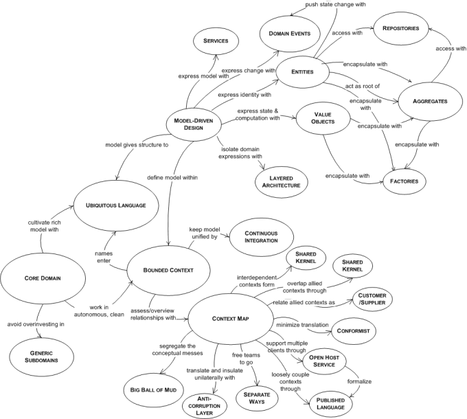

Temat DDD jest bardzo rozległy — nie jestem w stanie przedstawić całości wewnątrz jednego wpisu, dlatego jedynie streszczę ci, na czym polega praca z tym podejściem. **DDD to skrót od Domain Driven Design, czyli projektowanie oparte o domenę.** Termin dokładnie opisany przez m.in **Erica Evansa** w jego książce **„Domain-Driven Design. Zapanuj nad złożonym systemem informatycznym”**. Jednak nie był on jedyną osobą wyjaśniającą ten temat. Dobrze opisał DDD również **Vaughn Vernon** w **„Implementing Domain-Driven Design”**. Ale jeśli nie interesują cię ich dzieła, w internecie znajdziesz masę kursów i blogów z dogłębnymi opisami elementów DDD — jedną z polecanych osób jest tutaj **Martin Fowler**, który skupia się na tematach architektury oprogramowania.

## **Czym jest ta domena?**

Ale właśnie, co to domena? Patrząc na Wikipedię, możemy odnieść wrażenie, że to wszystko i nic, nie wiadomo dokładnie, na czym to się opiera.

> **Domena** (łac. _dominium_, „posiadłość, własność, włości, majątek, majętność, zwierzchność, zwierzchnictwo”, od _dominus_, „posiadacz, właściciel, włościan[in], władca, pan, zwierzchnik”) – wyraz oznaczający dziś obszar, pole, dział, gałąź, zakres, krąg, czy sferę, w szczególności: nauk, badań, zainteresowań itp

Dlatego warto byłoby dokładniej wyjaśnić, co powinniśmy rozumieć jako domenę, a dokładniej domenę w kontekście aplikacji, jakie tworzymy. W przypadku każdej aplikacji (tworzonej w języku obiektowym) spotykamy się z obiektami, które w jakiś sposób ze sobą reagują, przez co możemy powiedzieć, że aplikacja spełnia swoje zadanie. Jest to **logika aplikacji**, która najczęściej jest odzwierciedleniem logiki biznesowej za pomocą kodu. **Logika biznesowa** opisuje, w jaki sposób wyglądają procesy w pewnym biznesie, lub życiu — pojęcie „biznesowa” mogłoby nie istnieć w tym kontekście, jednak zazwyczaj przenosząc zachowania z rzeczywistości do kodu, przenosimy procesy z jakiegoś biznesu. **Logika aplikacji** to implementacja tych procesów w kodzie. A **domena** to cały określony obszar z rzeczywistości, w którym działamy, który posiada swoją logikę biznesową. Można to też nazwać obszarem tematycznym. Można wyróżnić także pojęcie takie jak **specjalista domenowy**, czyli specjalista z określonej branży, który wie dokładnie, jak wszystko powinno działać, jakie obiekty możemy wyróżnić, czym się one charakteryzują i jak one ze sobą reagują.

## **Czym jest modelowanie?**

Modelowane to w dużym skrócie ustalanie, z czego powinny składać się nasze obiekty. Możemy wyróżnić tutaj bogate modele domenowe (**Rich Domain Model**) i anemiczne (**Anemic Domain Model**), których główna różnica jest taka, że model anemiczny jedynie trzyma dane, a model bogaty posiada dodatkowo logikę domenową wewnątrz siebie. Może to być sama walidacja danych, ale możemy też rozwinąć nasze modele o dodatkowe funkcjonalności — przykładowo możemy skorzystać z **event sourcingu**, gdzie nasze modele w określonych sytuacjach by odpalały określone eventy — przykładowo podczas tworzenia nowego obiektu, lub edycji obecnego. Warto zwrócić tutaj uwagę również na agregaty i value object'y. Gdzie agregat to zbiór ściśle połączonych ze sobą obiektów, które współpracują ze sobą i nie mogą (nie powinny) istnieć samodzielnie. Należy wyróżnić tutaj też korzeń agregatu (**aggregate root**), czyli obiekt, za pomocą którego możemy się odwołać do reszty obiektów — przykładowo obiekt produktu w agregacie produktu. A value object, to obiekt, który wchodzi w skład agregatu. Value objecty powinny być niezmieniane (**immutable**). Przykładem agregatu może być produkt, a value object'em może być tutaj obiekt ceny, posiadający informacje o walucie i nominale. Oczywiście nie będzie to jedyny value object w naszym produkcie.

## **A co gdy kilka agregatów używa tego samego value object'u?**

Jeśli w każdym przypadku nasz value object będzie wyglądać tak samo (np obiekt pieniądza), wystarczy trzymać go w miejscu wspólnym — przykładowo w ścieżce lub przestrzeni nazw (namespace) commons lub shared, w naszej domenie. A co jeśli te obiekty będą różne? Przykładowo obiekt produktu wewnątrz agregatu zamówienia będzie musiał być inny niż obiekt produktu w obiekcie wysyłki towaru, a dodatkowo produkt będzie naszym agregatem? Przecież agregat nie może być naszym agregatem (mam tu na myśli obiekt będący korzeniem agregatu). W takiej sytuacji powinniśmy stworzyć kilka osobnych value object'ów, każdy dedykowany do określonej sytuacji. Już w 2003 roku Martin Fowler pisał, że stworzenie jednego modelu, który byłby idealny do każdej sytuacji, jest niemożliwe. To rozwiązanie sprawi, że w każdej sytuacji będziemy mieć dokładnie te dane, których aktualnie potrzebujemy — nie będziemy mieć niczego za dużo, ani za mało. Sytuacja, w której ten sam obiekt występuje w kilku miejscach to **bounded context**, czyli ograniczenie kontekstu.

## **Ale to jedynie najpopularniejsze elementy**

Elementów, z których składa się DDD, jest dużo więcej, co pokazuje przykładowo ten schemat: 
 

Dlatego w jednym poście nie jestem w stanie opisać każdego z elementów — jeśli temat cię zainteresował i chcesz zagłębić się w temat, zwróć uwagę na źródła, które opisałem na samym początku. 

**Uwaga** W poście czasami używam wyrażenia „obiekt”, mając na myśli model obiektu. Nie mam tu na myśl fizycznego obiektu, czyli instancji jakiejś klasy.
